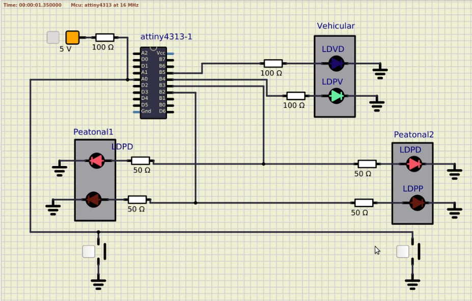

# Laboratorio 2. GPIOs, Timers y FSM

Este laboratorio consiste en la creación de un semáforo simplificado basado en el microcontrolador ATtiny4313. El diseño físico cuenta con dos semáforos peatonales y un semáforo para carros, cada uno tiene una luz roja y una luz verde. Además cuenta con dos botones para que los peatones solicite el cruce peatonal.

El semáforo está programado por una máquina de estados que cuenta con seis estados:
- Vehículos pasando: Es el estado base, cuando no se ha presionado el botón, el semáforo se queda en este estado. Si se ha presionado el botón, espera al menos 10 segundos en este estado para pasar al siguiente. En este estado la luz verde de carros y la luz roja de peatones se encuentran activadas.
- Semáforo de vehículos parpadeando: En este estado, la luz verde del semáforo de carros parpadea, su duración es de 3 segundos.
- Vehículos detenidos: En este estado la luz verde del semáforo de carros se apaga y se activa la luz roja. Sin embargo, se mantiene la luz roja de peatones para evitar un cruce de peatones anticipado. Su duración es de 1 segundo.
- Peatones pasando: En este estado, la luz verde del semáforo de peatones y la luz roja de carros se activan y la luz verde de carros y la luz roja de peatones se desactivan. Su duración es de 10 segundos. 
- Semáforo de peatones parpadeando: En este estado, la luz verde del semáforo de peatones parpadea, su duración es de 3 segundos.
- Peatones detenidos: En este estado la luz verde del semáforo de peatones se apaga y se activa la luz roja. Sin embargo, se mantiene la luz roja de carros para evitar un cruce de carros anticipado. Su duración es de 1 segundo.

El botón activa el cruce peatonal, generando una secuencia de estados que generan cambio de luces hasta regresar al estado base de carros cruzando. El botón fue programado por medio de interrupciones al igual que el temporizador que establece cuánto dura cada uno de los estados.

